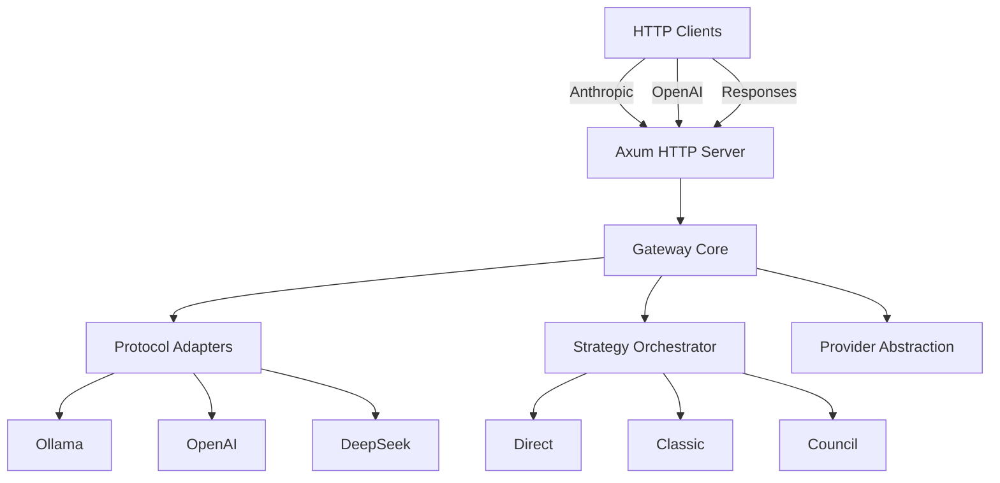
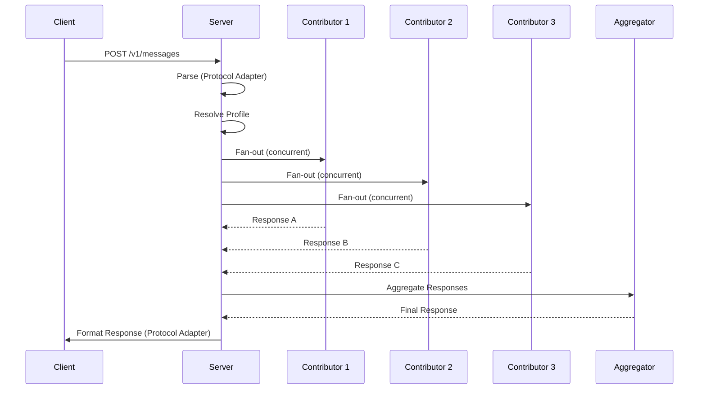

# Improved Rust Conversion Plan for MoA Gateway

## Executive Summary

**Current State**: Python FastAPI application (~3,679 lines of core code, ~2,000 lines of tests) implementing a Mixture-of-Agents gateway with:
- 3 protocol adapters (Anthropic Messages, OpenAI Chat Completions, OpenAI Responses)
- 4 provider types (Ollama, OpenAI, DeepSeek, OpenAI-compatible)
- 3 strategies (direct, classic, council)
- Configuration via YAML
- Benchmarking infrastructure
- Tracing system

**Target State**: Production-ready Rust application with:
- Async runtime (tokio)
- Web framework (axum)
- Async HTTP client (reqwest)
- Typed configuration (serde + config)
- Zero-copy streaming where possible

**Key Improvement**: This plan focuses on **behavioral parity first**, incremental validation, and evidence-based estimates. It replaces speculative performance claims with measurable criteria and defers over-engineering until concrete reuse requirements emerge.

---

## Phase 1: Foundation & Architecture

### 1.1 Project Structure

**Single-crate starting point** (simpler, easier to maintain):

```
moa-gateway-rs/
├── Cargo.toml                    # Dependencies
├── src/
│   ├── main.rs                   # CLI entry point
│   ├── app.rs                    # HTTP server (axum routes, auth, disconnect)
│   ├── config.rs                 # Configuration parsing and validation
│   ├── domain.rs                 # Core types (no I/O)
│   ├── gateway.rs                # Orchestration, strategies, retries, quorum
│   ├── protocols/
│   │   ├── mod.rs
│   │   ├── anthropic.rs        # Anthropic Messages protocol
│   │   ├── chat_completions.rs # OpenAI Chat Completions protocol
│   │   └── responses.rs        # OpenAI Responses protocol
│   ├── providers/
│   │   ├── mod.rs
│   │   ├── ollama.rs
│   │   ├── openai.rs
│   │   ├── deepseek.rs
│   │   └── openai_compatible.rs
│   ├── benchmark.rs              # Benchmarking harness
│   └── trace.rs                  # JSONL tracing
├── tests/
│   ├── unit/
│   ├── integration/
│   └── fixtures/
├── docs/                         # Architecture docs, Mermaid diagrams
└── moa.yaml                      # Example configuration
```

**Rationale**: The original four-crate design is excessive for ~3,679 lines of Python. Split crates only when there is a concrete reuse or compile-boundary requirement.

### 1.2 Key Dependencies

**Core**:
- `tokio` (async runtime)
- `axum` (web framework)
- `reqwest` (HTTP client)
- `serde` + `serde_yaml` (configuration)
- `tokio-stream` (streaming support)
- `tracing` + `tracing-subscriber` (logging)
- `thiserror` (error handling)
- `uuid` (request IDs)

**Protocol & Data**:
- `chrono` (timestamps)
- `once_cell` (global state)

**CLI**:
- `clap` (CLI parsing)
- `clap_complete` (shell completions)

**Benchmarking**:
- `criterion` (benchmarking framework)
- `tempfile` (temporary directories)

---

## Phase 2: Domain Model (Core Library)

### 2.1 Core Types

**Key structs** (using `#[derive(Serialize, Deserialize, Clone, Debug)]`):

```rust
// CanonicalRequest - normalized request format
#[derive(Clone, Debug)]
pub struct CanonicalRequest {
    pub requested_model: Option<String>,
    pub messages: Vec<Message>,
    pub max_tokens: Option<u32>,
    pub temperature: Option<f32>,
    pub stop: Option<StopSequence>,
    pub tools: Vec<Tool>,
    pub tool_choice: Option<ToolChoice>,
    // Ollama-specific
    pub think: Option<bool>,
    pub keep_alive: Option<KeepAlive>,
    pub num_ctx: Option<u32>,
    pub response_format: Option<ResponseFormat>,
}

// Completion - model response
#[derive(Clone, Debug)]
pub struct Completion {
    pub content: String,
    pub model: String,
    pub finish_reason: String,
    pub usage: Usage,
    pub panel_usage: Option<Usage>,
    pub tool_calls: Vec<ToolCall>,
    pub metrics: ProviderMetrics,
}

// StreamEvent - streaming events
#[derive(Clone, Debug)]
pub struct StreamEvent {
    pub content: Option<String>,
    pub tool_calls: Option<Vec<ToolCall>>,
    pub progress: Option<String>,
    pub error: Option<String>,
    pub finish_reason: Option<String>,
    pub usage: Option<Usage>,
    pub metrics: Option<ProviderMetrics>,
    pub done: bool,
}
```

**Key enums**:

```rust
#[derive(Clone, Debug)]
pub enum Strategy {
    Direct,
    Classic { min_quorum: u32 },
    Council { min_quorum: u32 },
}

#[derive(Clone, Debug)]
pub enum ProviderType {
    Ollama,
    OpenAI,
    DeepSeek,
    OpenAICompatible { base_url: String },
}
```

### 2.2 Protocol-Specific Event Grammars

**Critical**: Each protocol has a strict event ordering that must be preserved:

- **Anthropic**: `message_start`, content-block lifecycle events, `message_delta`, `message_stop`
- **Chat Completions**: `chat.completion.chunk` objects followed by `[DONE]`
- **Responses**: response, output-item, content-part, text/tool delta, and completion lifecycle events with increasing sequence numbers

These are implemented in `protocols/` and tested at `tests/test_api.py:285-330` and `tests/test_tools.py:73-107`.

---

## Phase 3: Provider Abstraction

### 3.1 Provider Trait

```rust
#[async_trait]
pub trait Provider: Send + Sync + 'static {
    async fn complete(
        &self,
        model: &str,
        request: &CanonicalRequest,
    ) -> Result<Completion, ProviderError>;

    fn stream(
        &self,
        model: &str,
        request: &CanonicalRequest,
    ) -> BoxStream<'_, Result<StreamEvent, ProviderError>>;

    async fn close(&self) -> Result<(), ProviderError>;
}
```

### 3.2 Provider Implementations

**Ollama Provider**:
- HTTP client to `http://127.0.0.1:11434`
- Endpoints: `/api/chat`, `/api/generate`
- Streaming via SSE
- Ollama-specific options (`num_ctx`, `keep_alive`, `think`)

**OpenAI/DeepSeek Providers**:
- HTTP client to respective APIs
- Endpoints: `/v1/chat/completions`
- Streaming via SSE
- Standard OpenAI format

**Error Handling**:
```rust
#[derive(thiserror::Error, Debug)]
pub enum ProviderError {
    #[error("HTTP {0}: {1}")]
    Http(u16, String),
    #[error("Timeout after {0:?}")]
    Timeout(Duration),
    #[error("Invalid response: {0}")]
    InvalidResponse(String),
    #[error("Stream ended without a response")]
    EmptyStream,
    // ... more variants
}
```

---

## Phase 4: Strategy Implementation

### 4.1 Strategy Trait

```rust
#[async_trait]
pub trait Strategy: Send + Sync + 'static {
    async fn execute(
        &self,
        gateway: &Gateway,
        request: &CanonicalRequest,
        request_id: &str,
    ) -> Result<Completion, StrategyError>;
    
    async fn stream(
        &self,
        gateway: &Gateway,
        request: &CanonicalRequest,
        request_id: &str,
    ) -> Result<BoxStream<'_, Result<StreamEvent, StrategyError>>, StrategyError>;
}
```

### 4.2 Strategy Implementations

**Direct Strategy**:
- Single provider call
- No orchestration overhead

**Classic Strategy**:
- Fan-out to proposers (concurrent)
- Wait for quorum
- Aggregate responses
- Retry logic for empty responses

**Council Strategy**:
- Similar to classic but with structured prompts
- 5 perspectives per contributor (Contrarian, First Principles Thinker, Maintainer, Outsider, Executor)
- Schema validation for JSON responses
- Contributor scoring

**Critical Behavior** (from `gateway.py:135-164`, `gateway.py:710-722`):
- Tool-result turns bypass the council through `tool_dispatch`
- Contributor requests remove system prompts, tool results, and empty assistant tool-call messages
- Quorum completion cancels remaining contributor tasks
- A global contributor deadline applies while waiting for quorum
- Structured council responses require all five non-empty fields
- Empty aggregation is retried with twice the token budget and thinking disabled
- A second empty result falls back to the strongest usable contribution
- Panel usage and client-visible usage have different meanings

---

## Phase 5: Protocol Adapters

### 5.1 Protocol Trait

```rust
#[async_trait]
pub trait ProtocolAdapter: Send + Sync + 'static {
    fn name() -> &'static str;
    
    async fn parse_request(body: &[u8]) -> Result<CanonicalRequest, ProtocolError>;
    
    fn format_response(completion: &Completion, model: &str) -> Vec<u8>;
    
    fn format_stream<'a>(
        events: BoxStream<'a, Result<StreamEvent, ProtocolError>>,
        model: &str,
    ) -> BoxStream<'a, Result<String, ProtocolError>>;
}
```

### 5.2 Protocol Implementations

**Anthropic Messages**:
- Parse: `POST /v1/messages` (with query string support, e.g., `?beta=true`)
- Events: `message_start`, content-block lifecycle events, `message_delta`, `message_stop`
- SSE format with event types

**OpenAI Chat Completions**:
- Parse: `POST /v1/chat/completions` and `POST /chat/completions` (DeepSeek-style)
- Format: OpenAI-compatible JSON
- Streaming: `chat.completion.chunk` format

**OpenAI Responses**:
- Parse: `POST /v1/responses`
- Format: Response API format
- Streaming: Response event sequence with sequence numbers

**Critical Behavior** (from `protocols.py:319-641`):
- Unknown models produce HTTP 404
- Bearer and `x-api-key` authentication are both supported
- Streaming tool-call argument fragments must remain fragmented
- Non-streaming requests monitor client disconnects and cancel gateway work
- After progress has already been emitted, errors must be represented inside the protocol stream

---

## Phase 6: Gateway Core

### 6.1 Gateway Struct

```rust
pub struct Gateway {
    config: GatewayConfig,
    providers: HashMap<String, Arc<dyn Provider>>,
    trace_recorder: Arc<TraceRecorder>,
}
```

**Rationale**: `Arc<RwLock<GatewayConfig>>` introduces runtime mutability without a reload requirement. The config is loaded once at startup and never mutated.

### 6.2 Key Methods

```rust
impl Gateway {
    pub async fn complete(
        &self,
        request: CanonicalRequest,
        request_id: &str,
        parent_request_id: Option<&str>,
    ) -> Result<Completion, GatewayError>;
    
    pub async fn stream(
        &self,
        request: CanonicalRequest,
        request_id: &str,
        parent_request_id: Option<&str>,
    ) -> Result<BoxStream<'_, Result<StreamEvent, GatewayError>>, GatewayError>;
    
    pub async fn warmup(&self, profiles: &[String]) -> Result<(), GatewayError>;
    
    pub fn public_model(&self, requested: &str) -> Result<String, GatewayError>;
    
    pub async fn close(&self) -> Result<(), GatewayError>;
}
```

### 6.3 Critical Orchestration Behavior

**From `gateway.py:1150-1185`** (structured council output):
```rust
// All five fields must be non-empty for council responses
// If any field is empty, the response is invalid
```

**From `gateway.py:1014-1090`** (empty aggregation retry and fallback):
```rust
// First empty result: retry with twice the token budget and thinking disabled
// Second empty result: fall back to the strongest non-empty contributor response
// If no fallback is available: return upstream error
```

**From `gateway.py:180-192`, `gateway.py:1128-1148`** (usage accounting):
```rust
// Client-visible usage: final model context and output in the facade's native semantics
// Panel usage: total provider usage across all contributors and aggregator
// Summing duplicated proposer input into Anthropic's input_tokens could cause
// Claude Code to compact its conversation too early
```

**From `gateway.py:451-511`** (streaming aggregation):
```rust
// Buffer output until visible content appears
// Allow an empty first attempt to be retried without leaking an invalid stream
```

---

## Phase 7: Configuration

### 7.1 Config Structure

```rust
#[derive(Deserialize, Serialize, Clone, Debug)]
pub struct GatewayConfig {
    pub server: ServerConfig,
    pub providers: HashMap<String, ProviderConfig>,
    pub profiles: HashMap<String, ProfileConfig>,
    pub default_profile: String,
}

#[derive(Deserialize, Serialize, Clone, Debug)]
pub struct ProfileConfig {
    pub aliases: Vec<String>,
    pub strategy: StrategyType,
    // Direct strategy fields
    pub provider: Option<String>,
    pub model: Option<String>,
    // MoA fields
    pub proposers: Vec<ModelTarget>,
    pub contributors: Vec<ModelTarget>,
    pub aggregator: Option<ModelTarget>,
    pub tool_dispatch: Option<ModelTarget>,
    // Quorum and timing
    pub min_quorum: u32,
    pub max_concurrency: u32,
    pub contributor_deadline_seconds: Option<f64>,
    // Token limits
    pub contributor_max_tokens: u32,
    pub proposer_max_tokens: u32,
    pub reference_token_budget: u32,
    // Ollama-specific
    pub reasoning_reserve: HashMap<String, u32>,
    // ... more fields
}
```

### 7.2 Config Loading

```rust
pub fn load_config(path: &Path) -> Result<GatewayConfig, ConfigError> {
    let yaml = std::fs::read_to_string(path)?;
    let config: GatewayConfig = serde_yaml::from_str(&yaml)?;
    config.validate()?;
    Ok(config)
}
```

**Critical Validation** (from `config.py:92-191`):
- Direct profiles require provider and model
- Direct profiles cannot define MoA targets
- Council profiles require at least three contributors with distinct `family` values
- Aggregator must be configured for MoA strategies

---

## Phase 8: Tracing System

### 8.1 Trace Recorder

```rust
pub struct TraceRecorder {
    path: Option<PathBuf>,
    max_bytes: u64,
    backup_count: u32,
    lock: Mutex<()>,
    parents: RwLock<HashMap<String, String>>,
}
```

### 8.2 Trace Events

```rust
#[derive(Serialize)]
pub struct TraceEvent {
    pub timestamp: String,  // ISO 8601
    pub request_id: String,
    pub parent_request_id: Option<String>,
    pub event: String,
    #[serde(flatten)]
    pub fields: HashMap<String, serde_json::Value>,
}
```

**Events** (from `gateway.py`):
- `request_started`, `request_completed`, `request_failed`, `request_cancelled`
- `model_started`, `model_completed`, `model_failed`, `model_cancelled`
- `stage_started`, `stage_completed`, `stage_failed`
- `contributor_scored`, `contributor_invalid`
- `warmup_started`, `warmup_completed`, `warmup_failed`
- `request_routed` (tool_dispatch)

**Critical Behavior** (from `trace.py`):
- Append-only JSONL format
- Records are flushed immediately
- Size bounding with truncation
- Rotation with configurable backup count
- Full prompts, tool results, and responses are logged (treat as sensitive local data)

---

## Phase 9: HTTP Server (axum)

### 9.1 Router Setup

```rust
pub fn create_router(config: Arc<GatewayConfig>, gateway: Arc<Gateway>) -> Router {
    Router::new()
        .route("/", get(root))
        .route("/health", get(health))
        .route("/models", get(list_models))
        .route("/v1/chat/completions", post(chat_completions))
        .route("/chat/completions", post(chat_completions)) // DeepSeek-style
        .route("/v1/messages", post(anthropic_messages))
        .route("/v1/messages", get(anthropic_messages)) // Query string support
        .route("/v1/responses", post(openai_responses))
        .with_state((config, gateway))
}
```

**Critical Behavior** (from `app.py:99-146`):
- Prefetch first event so failures before streaming can return HTTP 502
- Non-streaming requests monitor client disconnects and cancel gateway work
- After progress has already been emitted, errors must be represented inside the protocol stream

### 9.2 Handlers

```rust
async fn chat_completions(
    headers: HeaderMap,
    Query(query): Query<serde_json::Value>,
    Json(body): Json<serde_json::Value>,
    State((config, gateway)): State<(Arc<GatewayConfig>, Arc<Gateway>)>,
) -> Result<Response<Body>, HttpError> {
    // Authorization (Bearer and x-api-key)
    // Parse request
    // Call gateway
    // Format response
}
```

### 9.3 Streaming Support

```rust
async fn chat_completions_stream(
    // ... same params
) -> Result<impl IntoResponse, HttpError> {
    let events = gateway.stream(request, request_id, parent_id).await?;
    
    let stream = events.map(|result| {
        match result {
            Ok(event) => Ok::<String, Infallible>(format_event(event)),
            Err(e) => Ok::<String, Infallible>(format_error(e)),
        }
    });
    
    Ok(Response::new(Body::from_stream(stream)))
}
```

---

## Phase 10: CLI Tool

### 10.1 Commands

```rust
#[derive(Parser)]
enum Command {
    /// Create a starter configuration
    Init {
        /// Ollama model ID
        #[arg(short, long, default_value = "qwen2.5-coder:7b")]
        model: String,
    },
    
    /// Configuration operations
    Config {
        #[command(subcommand)]
        command: ConfigCommand,
    },
    
    /// Run the gateway server
    Serve,
    
    /// Show gateway status
    Status,
    
    /// Run benchmark
    Benchmark {
        /// Profiles to test
        #[arg(short, long, default_values_t = vec!["direct".into(), "council-k2".into(), "council-k3".into(), "self-consistency".into()])]
        profiles: Vec<String>,
        
        /// Number of runs
        #[arg(short, long, default_value = "1")]
        runs: u32,
        
        /// Output file
        #[arg(short, long, default_value = "benchmark-results.json")]
        output: PathBuf,
        
        /// Allow code execution
        #[arg(long)]
        allow_code_execution: bool,
    },
}
```

---

## Phase 11: Benchmarking

### 11.1 Benchmark Cases

```rust
pub struct BenchmarkCase {
    pub name: &'static str,
    pub prompt: &'static str,
    pub tests: &'static str,
}

pub static CASES: &[BenchmarkCase] = &[
    BenchmarkCase {
        name: "merge_intervals",
        prompt: "...",
        tests: "...",
    },
    // ... more cases
];
```

### 11.2 Execution

```rust
pub async fn run_benchmark(
    config: &GatewayConfig,
    profiles: &[String],
    runs: u32,
    output: &Path,
) -> Result<BenchmarkResult, BenchmarkError> {
    // For each run, profile, case:
    // 1. Execute request
    // 2. Extract code from response
    // 3. AST screening (invoke Python for validation)
    // 4. Run tests
    // 5. Record results
}
```

**Critical Behavior** (from `benchmark.py:121-171`):
- Generated Python is AST-screened before running deterministic tests
- AST validation and execution must be preserved (use Python subprocess or crate)
- The benchmark measures model quality, not just Rust performance

---

## Phase 12: Testing Strategy

### 12.1 Unit Tests

- **Provider tests**: Mock HTTP responses
- **Strategy tests**: Test orchestration logic
- **Protocol tests**: Parse/format round-trips
- **Config tests**: Validation edge cases

### 12.2 Integration Tests

- **End-to-end**: Full request flow
- **Streaming**: SSE event ordering
- **Error handling**: Timeout, failure recovery
- **Concurrency**: Quorum, parallel execution

### 12.3 Test Infrastructure

```rust
// Mock provider for testing
pub struct MockProvider {
    responses: Vec<Completion>,
    stream_events: Vec<StreamEvent>,
}

#[async_trait]
impl Provider for MockProvider {
    async fn complete(&self, _model: &str, _request: &CanonicalRequest) 
        -> Result<Completion, ProviderError> 
    {
        // Use index-based pop with bounds check
        Ok(self.responses.get(0).unwrap().clone())
    }
    
    fn stream(&self, _model: &str, _request: &CanonicalRequest)
        -> BoxStream<'_, Result<StreamEvent, ProviderError>>
    {
        stream::iter(self.stream_events.clone().into_iter().map(Ok)).boxed()
    }
}
```

**Critical**: The original plan's `pop()` example is incorrect because `Vec::pop` requires mutable access.

---

## Phase 13: Performance Optimization

### 13.1 Key Optimizations

1. **Zero-copy streaming**: Use `Bytes` instead of `String` where possible
2. **Connection pooling**: Reuse HTTP clients
3. **Async batching**: Concurrent provider calls
4. **Memory pools**: Reuse buffers for streaming

### 13.2 Benchmarking

```rust
#[cfg(test)]
mod benchmarks {
    use criterion::{black_box, criterion_group, criterion_main, Criterion};
    
    fn complete_request(c: &mut Criterion) {
        let gateway = create_test_gateway();
        let request = create_test_request();
        
        c.bench_function("complete_request", |b| {
            b.to_async(tokio::runtime::Runtime::new().unwrap()).iter(|| {
                let gateway = &gateway;
                let request = &request;
                async move { gateway.complete(black_box(request)).await }
            })
        });
    }
    
    criterion_group!(benches, complete_request);
    criterion_main!(benches);
}
```

### 13.3 Performance Targets (Evidence-Based)

**Replace speculative claims with measurement criteria**:

- No regression in model latency beyond statistical variance
- Reduced gateway-only overhead under a fake provider
- Lower idle RSS
- Equivalent cancellation latency
- Equivalent or better maximum open SSE connections

**Rationale**: Most latency comes from model loading and generation, not FastAPI or Python orchestration. A Rust rewrite may substantially reduce idle memory and improve connection handling, but a 20-30% end-to-end latency reduction or 5x throughput should not be promised without measurements.

---

## Phase 14: Documentation

### 14.1 Architecture Diagrams

**High-level Architecture** (Mermaid):



**Request Flow (Council Strategy)** (Mermaid):



**Required Diagrams**:
- Rust type and trait relationships
- Direct request sequence
- Council quorum, cancellation, retry, and fallback flow
- Streaming lifecycle and prefetch error flow
- Tool-result dispatch flow
- Configuration validation flow
- Migration and cutover flow

### 14.2 API Documentation

- **OpenAPI/Swagger**: Generate from axum routes
- **Rustdoc**: Document all public APIs
- **Architecture Decision Records (ADRs)**: Document key decisions

---

## Phase 15: Migration Strategy

### 15.1 Incremental Approach

**Phase 1: Configuration & Domain Types** (Week 1)
- Domain types (CanonicalRequest, Completion, StreamEvent)
- Config parsing and validation
- Unit tests for types

**Phase 2: Fake Provider & Direct Gateway** (Week 2)
- Mock provider for testing
- Direct strategy (single provider call)
- Chat Completions endpoint
- Parity tests against Python baseline

**Phase 3: Ollama Provider & Streaming** (Week 3)
- Ollama provider implementation
- Streaming support
- SSE event ordering tests

**Phase 4: Classic MoA** (Week 4)
- Classic strategy (proposers, quorum, aggregation)
- Retry and fallback logic
- Usage accounting

**Phase 5: Council MoA** (Week 5)
- Council strategy (5 perspectives, schema validation)
- Contributor scoring
- Structured output validation

**Phase 6: Protocol Adapters** (Week 6)
- Anthropic Messages adapter
- OpenAI Responses adapter
- Query string and unversioned endpoint support

**Phase 7: CLI & Tracing** (Week 7)
- CLI commands (init, config, serve, status, benchmark)
- JSONL tracing
- PID file and warmup

**Phase 8: Testing & Docs** (Week 8-9)
- Integration tests
- Performance benchmarks
- Documentation
- Examples

**Phase 9: Cutover** (Week 10)
- Side-by-side conformance tests
- Load tests
- Gradual rollout

### 15.2 Compatibility Matrix

| Feature | Python | Rust | Status |
|---------|--------|------|--------|
| Direct strategy | ✓ | ✓ | Phase 2 |
| Classic strategy | ✓ | ✓ | Phase 4 |
| Council strategy | ✓ | ✓ | Phase 5 |
| Ollama provider | ✓ | ✓ | Phase 3 |
| OpenAI provider | ✓ | ✓ | Phase 3 |
| DeepSeek provider | ✓ | ✓ | Phase 3 |
| Anthropic protocol | ✓ | ✓ | Phase 6 |
| OpenAI protocol | ✓ | ✓ | Phase 6 |
| Responses protocol | ✓ | ✓ | Phase 6 |
| Streaming | ✓ | ✓ | Phase 3 |
| Tracing | ✓ | ✓ | Phase 7 |
| Benchmarking | ✓ | ✓ | Phase 7 |
| CLI | ✓ | ✓ | Phase 7 |
| Tool calls | ✓ | ✓ | Phase 2 |
| Quorum | ✓ | ✓ | Phase 4 |
| Cancellation | ✓ | ✓ | Phase 2 |
| Usage accounting | ✓ | ✓ | Phase 4 |

---

## Phase 16: Error Handling

### 16.1 Error Types

```rust
#[derive(thiserror::Error, Debug)]
pub enum GatewayError {
    #[error("Configuration error: {0}")]
    Config(#[from] ConfigError),
    
    #[error("Provider error: {0}")]
    Provider(#[from] ProviderError),
    
    #[error("Strategy error: {0}")]
    Strategy(#[from] StrategyError),
    
    #[error("Protocol error: {0}")]
    Protocol(#[from] ProtocolError),
    
    #[error("Trace error: {0}")]
    Trace(#[from] TraceError),
    
    #[error("Not found: {0}")]
    NotFound(String),
    
    #[error("Invalid request: {0}")]
    InvalidRequest(String),
    
    #[error("Timeout after {0:?}")]
    Timeout(Duration),
    
    #[error("Client disconnected")]
    ClientDisconnected,
}
```

### 16.2 Error Propagation

- Use `?` operator for automatic conversion
- Log errors with context
- Return user-friendly messages
- Preserve protocol-specific error formats

---

## Phase 17: Security Considerations

### 17.1 Authentication

- Bearer token validation (constant-time comparison)
- API key from environment
- HMAC comparison (constant-time)

### 17.2 Input Validation

- Strict schema validation
- Size limits on requests
- Rate limiting (optional)

### 17.3 Secure Defaults

- **HTTPS by default is incorrect**: The product is a local single-user deployment with local Ollama HTTP endpoint
- TLS should be optional or delegated to a reverse proxy
- Timeout on all external calls
- No debug info in production
- **Critical**: Traces contain complete prompts, tool results, and responses (treat as sensitive local data)

---

## Phase 18: Deployment

### 18.1 Docker

```dockerfile
FROM rust:1.80-slim AS builder
WORKDIR /app
COPY . .
RUN cargo build --release

FROM gcr.io/distroless/cc-debian12
COPY --from=builder /app/target/release/moa-gateway-server /usr/local/bin/moa-gateway
EXPOSE 14598
CMD ["moa-gateway", "serve"]
```

**Rationale**: The original plan's "single static binary" claim is not established because `distroless/cc` requires dynamic linking. The plan must choose and test a TLS/backend strategy before claiming static deployment.

### 18.2 Systemd Service

```ini
[Unit]
Description=MoA Gateway
After=network.target

[Service]
Type=simple
User=moa
Group=moa
ExecStart=/usr/local/bin/moa-gateway serve
Restart=on-failure
Environment=MOA_API_KEY=...

[Install]
WantedBy=multi-user.target
```

---

## Phase 19: Monitoring & Observability

### 19.1 Metrics

- Request latency (histogram)
- Request count (counter)
- Error rate (counter)
- Provider call duration (histogram)

### 19.2 Health Checks

- `/health` endpoint
- Provider connectivity checks
- Disk space for tracing

### 19.3 Logging

- Structured JSON logs
- Request correlation IDs
- Performance metrics

---

## Phase 20: Baseline & Validation

### 20.1 Python Baseline

**Current Status**: 63 passed, 1 failed

**Failing Test**: `tests/test_config.py::test_council_requires_all_distinct_contributor_families`

- Expected: `profile.aggregator.model == "qwen3.6:27b"`
- Actual: `"Qwen/Qwen3-Coder-Next-FP8"`

**Resolution**: Fix `moa.yaml` or update test expectation before defining Python as the migration oracle.

### 20.2 Golden Differential Tests

**Critical Gap**: The plan does not include a behavioral-parity inventory or golden differential tests.

**Solution**: Extract protocol and orchestration fixtures from the current 64 tests. Each Rust vertical slice should pass the matching fixtures before proceeding.

---

## Conclusion

This improved plan provides a comprehensive, evidence-based roadmap for converting the MoA Gateway from Python to Rust. The key improvements are:

1. **Behavioral parity first**: Focus on exact protocol and orchestration behavior before performance claims
2. **Incremental validation**: Each phase must pass parity tests against the Python baseline
3. **Evidence-based estimates**: Replace speculative performance claims with measurable criteria
4. **Simpler architecture**: Single-crate starting point, split only when concrete reuse emerges
5. **Complete diagrams**: Mermaid diagrams for all critical flows
6. **Testing-driven**: Golden differential tests from Python baseline drive migration

The incremental approach ensures we can validate each component before moving to the next, with full test coverage throughout.

**Next Steps**:
1. Fix Python baseline and freeze protocol/config fixtures
2. Define exact current parity versus future feature scope
3. Implement one vertical slice: config, fake provider, direct gateway, Chat Completions, streaming, and tests
4. Add Ollama and OpenAI-compatible provider parity
5. Add Anthropic and Responses protocol parity
6. Add classic and council orchestration with quorum, cancellation, retries, fallback, and usage accounting
7. Add tracing, warmup, CLI/PID behavior, and benchmark integration
8. Run side-by-side conformance and load tests before cutover
9. Add Mermaid class and flow diagrams based on the final design
